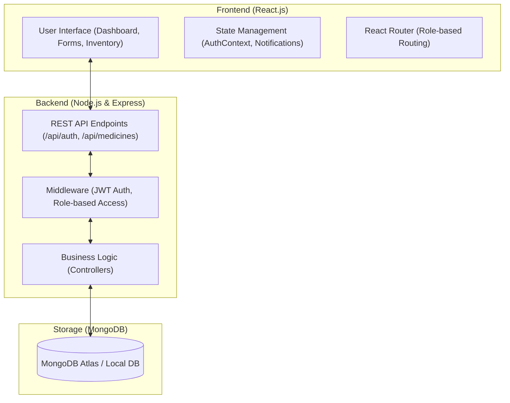
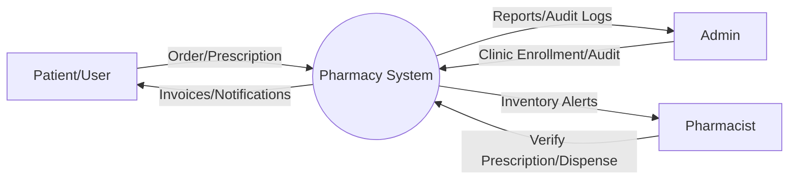
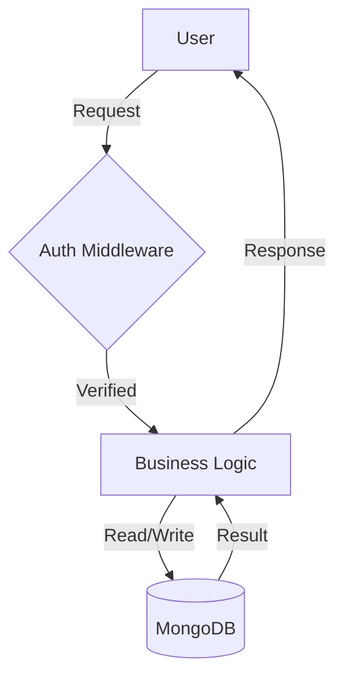
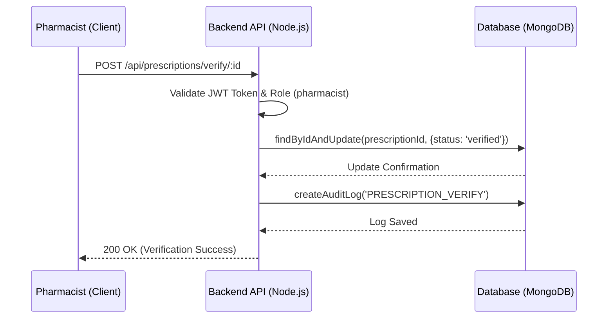
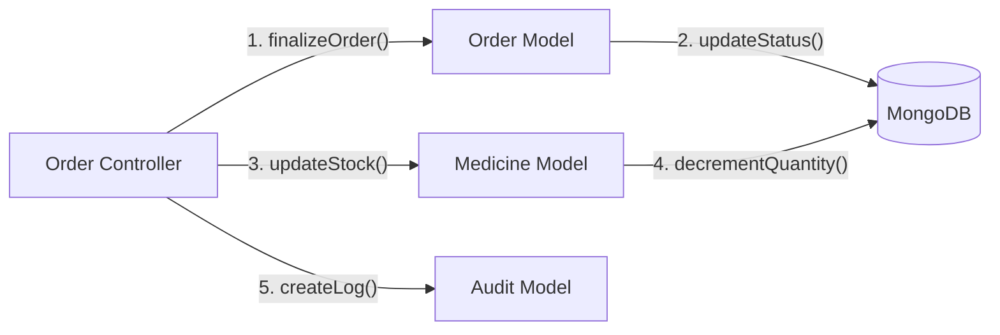
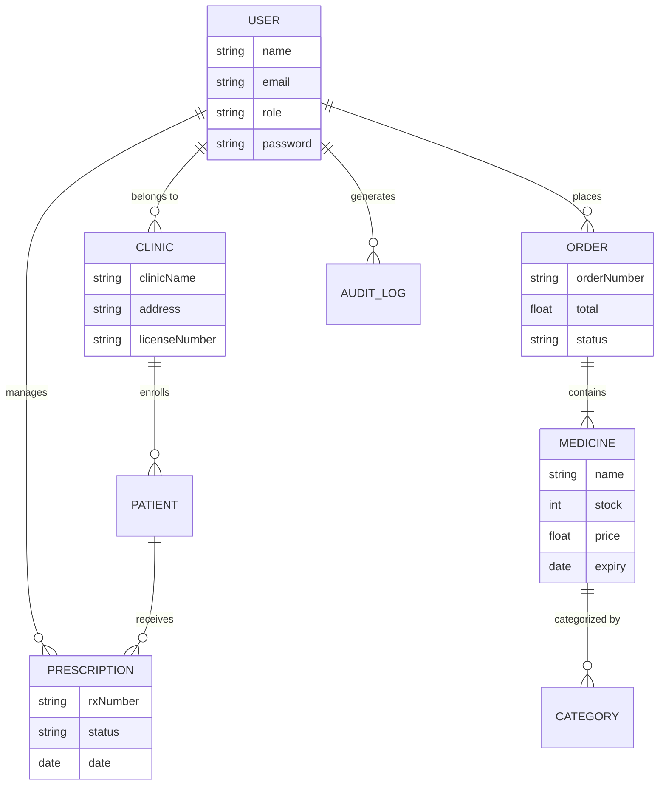

# Project Documentation - Pharmacy Management System

## Chapter 4: Design and Implementation

This chapter provides a detailed overview of the system's architecture, data flow, and design patterns used during implementation.

### 4.1 Architecture Diagram
The system follows the **MERN (MongoDB, Express, React, Node.js)** stack architecture, which adheres to a decoupled, client-server model.



### 4.2 Data Flow Diagram (DFD)
#### Level 0: Context Diagram
The context diagram shows the system as a single process interacting with external entities.



#### Level 1: Process Diagram
Detailed internal data flows for core modules.



### 4.3 Use Case Diagram
The use case diagram illustrates the interactions between different actors and the system's functionalities.

```mermaid
useCaseDiagram
    actor "Admin" as A
    actor "Pharmacist" as P
    actor "Clinic" as C
    actor "Patient/User" as U

    package "Pharmacy Management System" {
        usecase "Enroll Clinics" as UC1
        usecase "Manage Inventory" as UC2
        usecase "Verify Prescriptions" as UC3
        usecase "Order Medicines" as UC4
        usecase "Generate Reports" as UC5
        usecase "View Audit Logs" as UC6
    }

    A --> UC1
    A --> UC5
    A --> UC6
    P --> UC2
    P --> UC3
    P --> UC5
    C --> UC4
    U --> UC4
```

### 4.5 Sequence Diagram: Prescription Verification Flow
This diagram details the step-by-step interaction between the Pharmacist, the Backend API, and the Database when verifying a prescription.



### 4.6 Collaborative Diagram
Illustrates how objects collaborate to fulfill a complex request like updating inventory after an order.



### 4.7 Database Diagram - ER Diagram
A comprehensive look at the relational logic within the MongoDB collections.



---

## Chapter 5: Testing and System Implementation

### 5.1 System Implementation
The implementation phase involved setting up the environment, deploying the database, and configuring secondary services.

#### Environment Setup
- **Development Language**: Node.js (v18+) and React.js (v18).
- **Database**: MongoDB Atlas or Local MongoDB instance.
- **Authentication**: JSON Web Tokens (JWT) with secure HTTP-only cookies.
- **File Management**: Multer-based local storage for prescription images.

#### Configuration (Environment Variables)
1. `PORT`: Port on which the server runs (default: 5000).
2. `MONGODB_URI`: Connection string for the database.
3. `JWT_SECRET`: Secret key for token encryption.

### 5.2 Testing Methodology
Testing was conducted iteratively to ensure stability and cross-browser compatibility.

#### Unit Testing
Individual modules and helper functions were tested using **Jest**. For instance, the `User` model's password hashing and comparison methods were unit-tested to ensure security standards.

#### Integration Testing
Integration testing focused on the API layer using **Supertest**.
- **Scenario**: Admin creating a new clinic.
- **Verification**: Database record creation, audit log generation, and correct HTTP response codes.

#### User Acceptance Testing (UAT)
Conducted by simulating specific user roles:
| Actor | Test Case | Expected Result |
| :--- | :--- | :--- |
| **Admin** | Create a Clinic | Form validates, clinic saved to DB, and appears in list. |
| **Pharmacist** | Restock Medicine | Stock count increments correctly in the database. |
| **Patient** | Upload Prescription | Image uploads successfully, status becomes 'Pending'. |

### 5.3 System Maintenance
- **Audit Logging**: Every sensitive action (Price changes, deletions) is captured in `AuditLog` collection.
- **Security Scans**: Regular checks for outdated dependencies via `npm audit`.
- **Backup**: Database is periodically backed up to prevent zero-day data loss.
